# GC Closet Manager - Architecture Diagrams

This document provides comprehensive architecture diagrams for the GC Closet Manager application.

## Table of Contents
1. [System Overview](#system-overview)
2. [High-Level Architecture](#high-level-architecture)
3. [Frontend Architecture](#frontend-architecture)
4. [Backend Architecture](#backend-architecture)
5. [Data Flow Diagrams](#data-flow-diagrams)
6. [Deployment Architecture](#deployment-architecture)
7. [Technology Stack](#technology-stack)

---

## System Overview

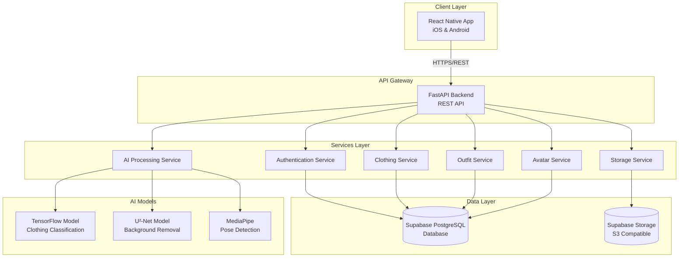

---

## High-Level Architecture

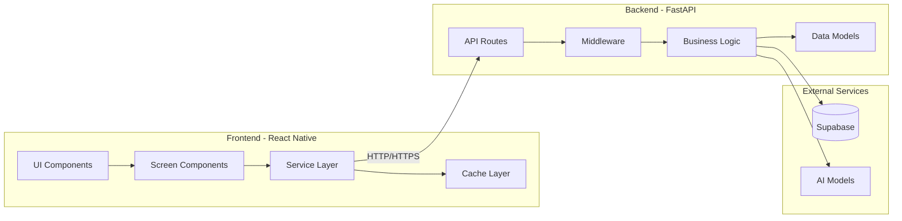

---

## Frontend Architecture

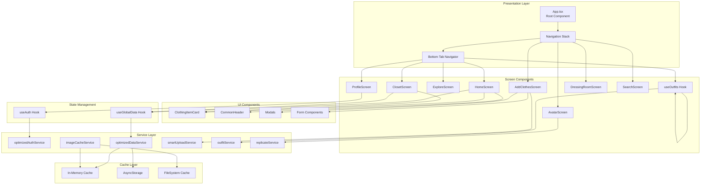

---

## Backend Architecture

```mermaid
graph TD
    subgraph "API Layer"
        Main[main.py<br/>FastAPI App]
        Router[API Router<br/>/api/v1]
    end
    
    subgraph "Route Handlers"
        AuthRouter[/auth/*]
        ClothesRouter[/clothes/*]
        OutfitsRouter[/outfits/*]
        AvatarRouter[/avatar/*]
        UploadRouter[/upload/*]
        ImagesRouter[/images/*]
        AdminRouter[/admin/*]
    end
    
    subgraph "Middleware"
        CORS[CORS Middleware]
        Security[Security Middleware]
        AuthMiddleware[Auth Middleware]
        Logging[Logging Middleware]
    end
    
    subgraph "Service Layer"
        AuthService[AuthService]
        DatabaseService[DatabaseService]
        StorageService[StorageService]
        OutfitService[OutfitService]
        AvatarService[AvatarService]
        BackgroundRemoval[BackgroundRemovalService]
        Classifier[ClothingClassifier]
        EnhancedClassifier[EnhancedClothingClassifier]
        TitleGenerator[TitleGenerator]
        ReplicateService[ReplicateService]
    end
    
    subgraph "Core Components"
        Models[Pydantic Models]
        Exceptions[Exception Handlers]
        Logger[Logging System]
        Config[Settings/Config]
    end
    
    subgraph "External Dependencies"
        Supabase[(Supabase Client)]
        AI[AI Models]
    end
    
    Main --> Router
    Router --> AuthRouter
    Router --> ClothesRouter
    Router --> OutfitsRouter
    Router --> AvatarRouter
    Router --> UploadRouter
    Router --> ImagesRouter
    Router --> AdminRouter
    
    Main --> CORS
    Main --> Security
    Main --> AuthMiddleware
    Main --> Logging
    
    AuthRouter --> AuthService
    ClothesRouter --> DatabaseService
    ClothesRouter --> StorageService
    OutfitsRouter --> OutfitService
    OutfitsRouter --> DatabaseService
    AvatarRouter --> AvatarService
    UploadRouter --> BackgroundRemoval
    UploadRouter --> Classifier
    UploadRouter --> EnhancedClassifier
    UploadRouter --> TitleGenerator
    UploadRouter --> StorageService
    
    AuthService --> Supabase
    DatabaseService --> Supabase
    StorageService --> Supabase
    AvatarService --> AI
    BackgroundRemoval --> AI
    Classifier --> AI
    EnhancedClassifier --> AI
    
    AuthService --> Models
    DatabaseService --> Models
    OutfitService --> Models
    
    Main --> Exceptions
    Main --> Logger
    Main --> Config
```

---

## Data Flow Diagrams

### Authentication Flow

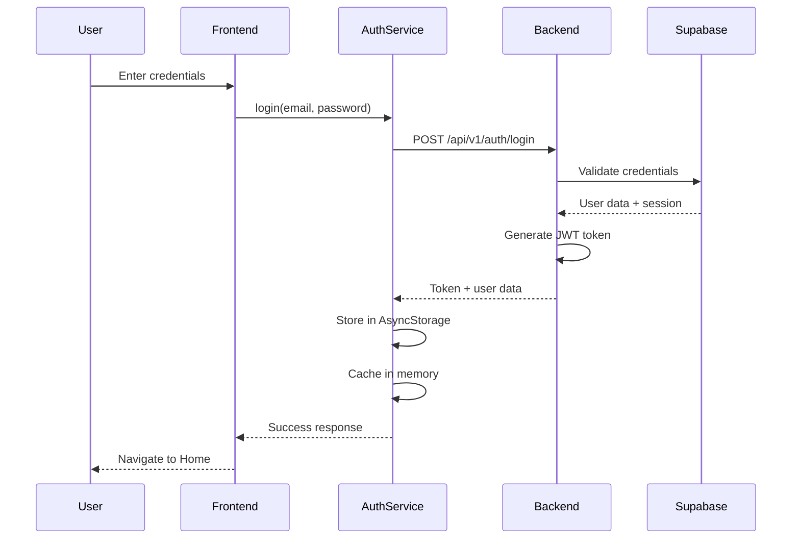

### Clothing Item Upload Flow

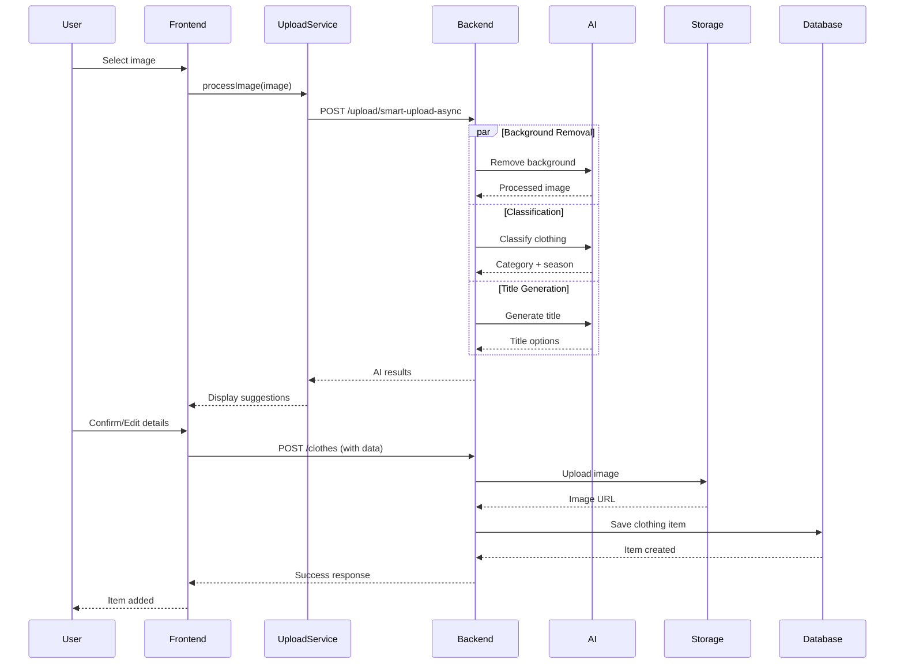

### Virtual Try-On Flow

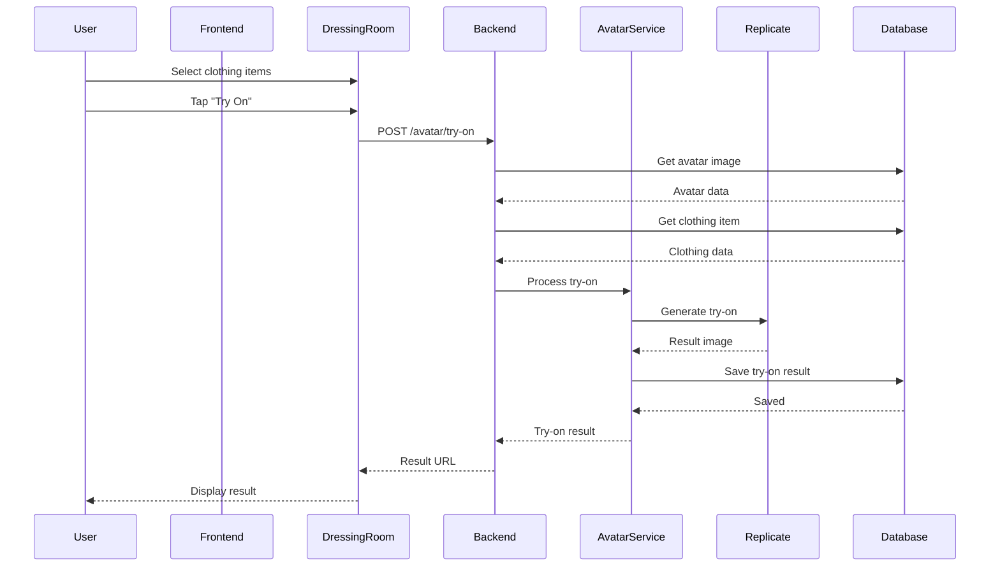

### Data Caching Flow

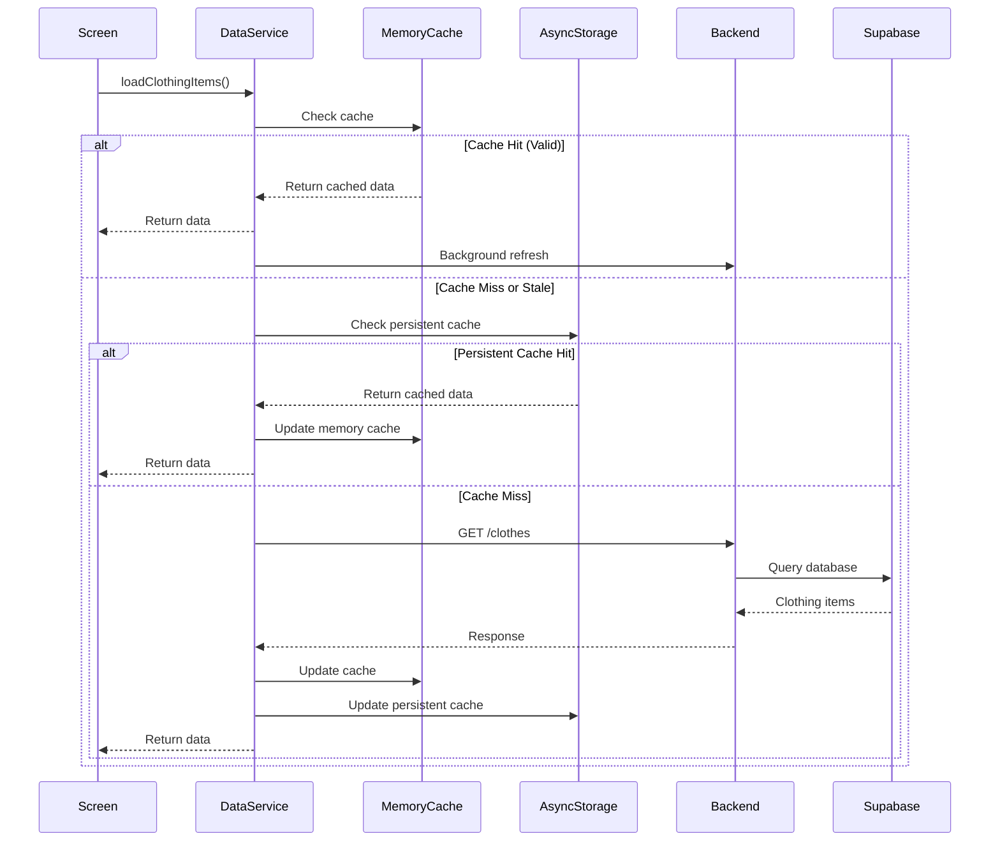

---

## Deployment Architecture

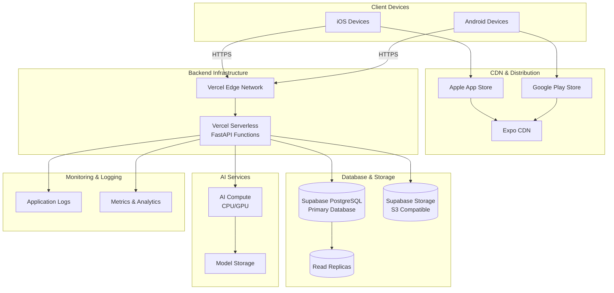

---

## Technology Stack

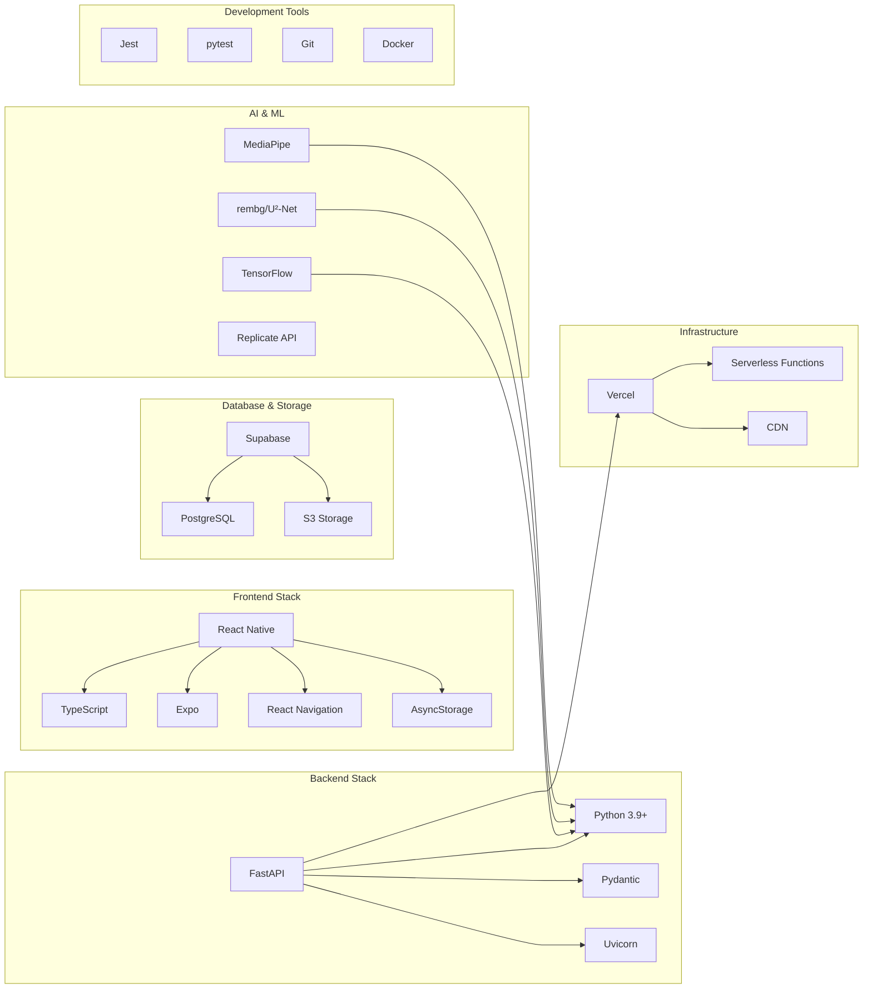

---

## Component Interaction Diagram

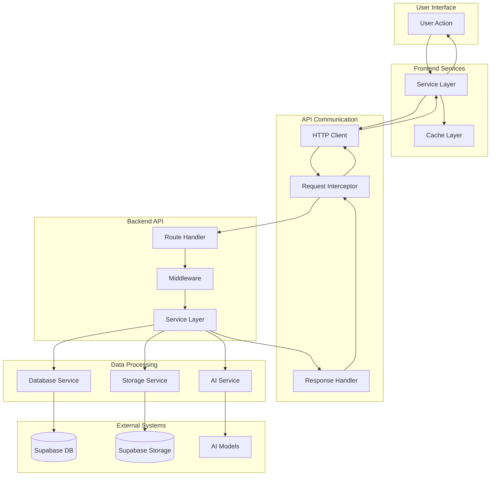

---

## Security Architecture

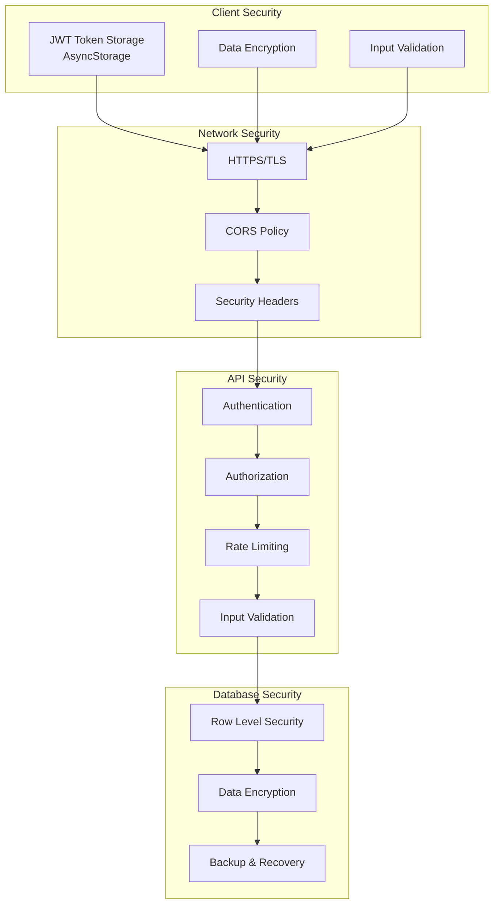

---

## AI Processing Pipeline

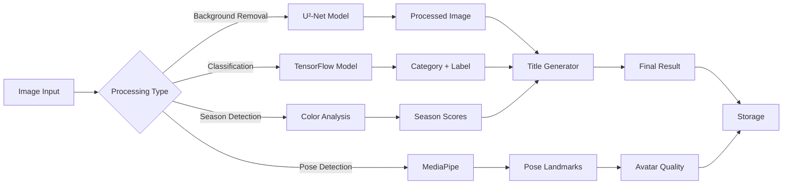

---

## File Structure Overview

```
gc-closet-manager/
├── gc-ui/ (React Native Frontend)
│   ├── src/
│   │   ├── components/     # Reusable UI components
│   │   ├── screens/        # Screen components
│   │   ├── services/       # API & business logic
│   │   ├── hooks/          # Custom React hooks
│   │   ├── navigation/     # Navigation setup
│   │   ├── types/          # TypeScript types
│   │   └── utils/          # Utility functions
│   └── assets/             # Images, fonts, etc.
│
└── gc-service/ (FastAPI Backend)
    ├── app/
    │   ├── api/v1/         # API route handlers
    │   ├── core/           # Core functionality
    │   ├── middleware/     # Middleware components
    │   ├── models/         # Pydantic models
    │   ├── services/       # Business logic services
    │   └── utils/          # Utility functions
    ├── config/             # Configuration
    ├── ai_models/          # AI model files
    └── tests/              # Test files
```

---

## Performance Optimization Architecture

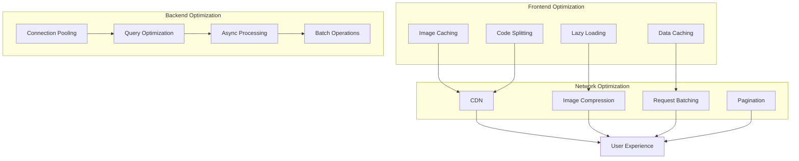

---

## Notes

- All diagrams use Mermaid syntax and can be rendered in most markdown viewers
- For best viewing, use tools like:
  - GitHub (renders Mermaid natively)
  - VS Code with Mermaid extension
  - Online Mermaid editors
  - Documentation platforms (GitBook, Notion, etc.)

- Architecture is designed for:
  - Scalability (serverless, auto-scaling)
  - Performance (caching, optimization)
  - Security (JWT, RLS, encryption)
  - Maintainability (modular, testable)

---

*Last Updated: Based on current codebase structure*

